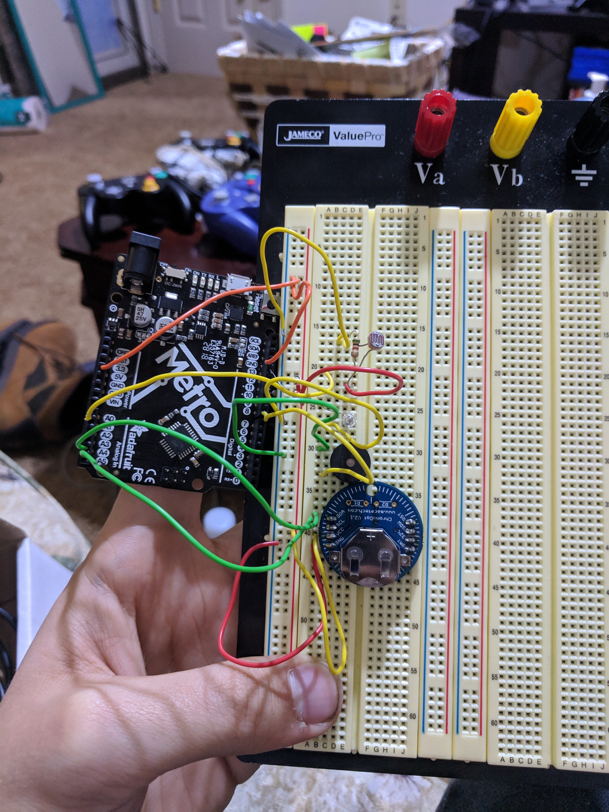

# P00: Project 1
*Light Sensing alarm clock.*

**Author(s)**: *Robert Hogsed, Dustin Young*

**Google Document**: *https://docs.google.com/document/d/13ItNKoVccImAGchtWhf9rGwZOyrfzWHT7rk_OlpwcUo/edit?usp=sharing*

---
## Purpose

Once common problem with an alarm clock is that most people will simply hit the snooze button and still not wake up. Our solution is to create an alarm clock that uses a light sensor to make sure that you've gotten out of bed and turned on your light before the alarm stops ringing. Additionally, the device should be able to detect the light level and only turn off at a certain threshold. For example, if the user wakes up and simply tries to shine a light from their phone on the device, it should preferably not turn off. If you've already stood up, walked across your room, and turned on your light you are much less likely to fall back asleep.

## Initial Design Plan

The following components will be used in our design.

- Arduino Metro - This is what controls everything.
- Photo-resistor - Will detect light levels in the room to determine when to stop the alarm.
- Speaker - This will make an incredibly irritating noise until the light sensor is tripped and the alarm shuts off.
- Real Time Clock - This will be able to tell the time, which will control when the device begins sounding off.
- Led light - This will work as just a second indicator of when the alarm is sounding and will shut off when enough light is detected.

**Possible Addition**
- We are considering adding a temperature sensor as well as a few more colored leds. Different colored leds will light up to indicate roughly what the temperature is.
- We also wanted to add a text to speech generator to read out the current time in the morning.

**Very early version 1**:

**Our actual work so far**:

Where we are at as of 1/24/19. There is a led that will stay lit when the light level is above the alarm shutoff point. The buzzer is used to make the alarm sound, but we would like to switch this to a larger speaker for a bit more volume. Then we have the light sensor. We have tested it a lot and right now we have it to where the alarm will not sound as long as the light in the room is bright enough. When we cover the sensor to reduce the light level the alarm begins to sound and the LED shuts off. Next we will work on getting the real time clock up and running and have our code only run between a set time (whenever you want to set your alarm for)

**clock is up and running**

The RTC is now set up and ticking. The alarm part of the code is now up and working and our alarm will sound when the clock reaches whatever time you have it set for, currently it is set for 7:30 and will ring until it shuts off either by you turning on the lights or when it eventually gives up at 7:40.

**full alarm system is up**

The full alarm is up and working, I am also including a link to a Youtube video I made showing it works properly. https://www.youtube.com/watch?v=IZ8XEPMw9Ls

## Files
- alarmclock - this is our code for the actual project. We are happy with the project so far
- v1 - This was a basic mockup drawing made in Fritzing.
- v2 - This is a picture of what we have so far. We still need to add the real world clock which we are figuring out how to use.
- rtc.jpg - picture of clock after getting it set up
- v3 - Build of the alarm clock as of 1/31/19
- README.md - This file keeps track of our project, and lays out out plans and ideas
- designdoc.docx - A Google doc that explains our project the pieces to it and how it works
- TRClib.zip library to set up the RTC    -https://github.com/adafruit/RTClib

## Summary

Now that our project is nearing completion, it is safe to say that our initial design plan didn't end up changing a great deal. If time permits, there are a few additions that we could consider adding to the final project. As of now however, the alarm achieves everything we set out to do. After a time is set by the user, the alarm will begin ringing at that time. The only way to turn the alarm off is to get up and turn on the lights, or break the device if you're in a bad mood. This should help to prevent users from falling back asleep after they wake up. If you already had to get up and walk to the light, then you're much less likely to go back to sleep.

Overall, the final product didn't require an enormous amount of coding. All of the parts that we used had excellent documentation on the Arduino website, which helped us whenever we had questions about a part or a section of code. Since the project was relatively straightforward, we had the idea to add some additional functionalities to it, such as a temperature sensor or a text-to-speech module. The temperature module would have read the ambient temperature and told the user if a jacket was necessary, while the text-to-speech module would have been a customizable addition that would further motivate the user to wake up.

Certain plans like temperature sensor and the text to speech module have not made it into our project at this point. The temperature sensor was reading inacurate temperatures, and the text to speech module would only output sound through headphones. Hopefully at least one of these will be ready before we present on tuesday.

In conclusion, the project was a great way to be introduced to the Arduino IDE. It allowed us to create a device that would be legitimately useful to us, and allowed us to explore the code that we would be using for the rest of the class. We both enjoyed working on the project and the experience gained will certainly be useful for future assignments and projects.

## Instructions
1. Set the time which you want the alarm to go off
2. At that time, the alarm will begin ringing in an incredibly irritating fashion.
3. The only way to shut off the alarm is to get out of bed, and turn on the lights.
4. This should trigger the photo-resistor, shutting off the alarm.

## Errors and Constraints
- One constraint we foresee is not knowing the exact ambient light level of every room. All our testing so far has been set up in the classroom. Additional testing in various lighting levels should help us alleviate this issue.
- I have noticed that the RTC has lost time before. Sometimes it's just a few seconds, but sometimes it's a few minutes and I am not sure why.
- Wires sometimes come a little loose or slip out, there are so many that some fit more snug than others. This is mainly a hardware issue.
- Because of the way the code is set up you cannot have your alarm set for a perfect hour time like 8am, the alarm will go off at 8:01 as the alarm range must be between two separate minute values. So if you set the minute values between 0 and 10, it will start at the 01 minute and end at the 11 minute of the hour.

## Reflection

Reflecting on the final product we are not disapointed. We completed everything we set out to do originally, and though some of the addtions we though of later on are not ready yet, with a bit more time we could likely get them working too. We learned a lot during this assignment, and it required a lot of hard thinking. Figuring out how to get the f=different sensors to work together was a real challenge but its so satifiing actually having a finished product.

I would have liked to get some of our other ideas implemented in time, we were starting to understad the modules but couldnt quite work out all the kinks. Meeting up outisde of class is hard sometimes so sometimes it limits the total ammount of progress that can be achived as a team, but we are still happy we completed what our original goal was.

## References
- v1 picture made in fritzing app
  - http://fritzing.org/home/
- Photo-resistor help
  - https://learn.adafruit.com/photocells/arduino-code
- buzzer help was found in the Arduino IDE examples library
- Led light help
  - https://www.arduino.cc/en/tutorial/blink
- Markdown help for readme
  - https://www.markdownguide.org/cheat-sheet/
- Chronodot setup
  - https://github.com/adafruit/RTClib
- Details on the Real Time Clock used for our project.
  - https://www.adafruit.com/product/255
- Provided sample code for the RTC.
  - https://learn.adafruit.com/adafruit-pcf8523-real-time-clock/rtc-with-arduino
- More documentation for RTC
  - http://docs.macetech.com/doku.php/chronodot_v2.0
- Documentation for Emic 2 Text-to-Speech module. This is a possible add-on for our alarm, if time allows.
  - https://www.parallax.com/downloads/emic-2-arduino-example-code

## Final Self-Evaluations

### Ideation, Brainstorming, Design:

*Robert: 5*

*Dustin: 5*

### Code creation:

*Robert: 5*

*Dustin 5*

### Documentation creation:

*Robert: 5*

*Dustin: 5*

### Teamwork & Participation:

*Robert: 5*

*Dustin: 5*
