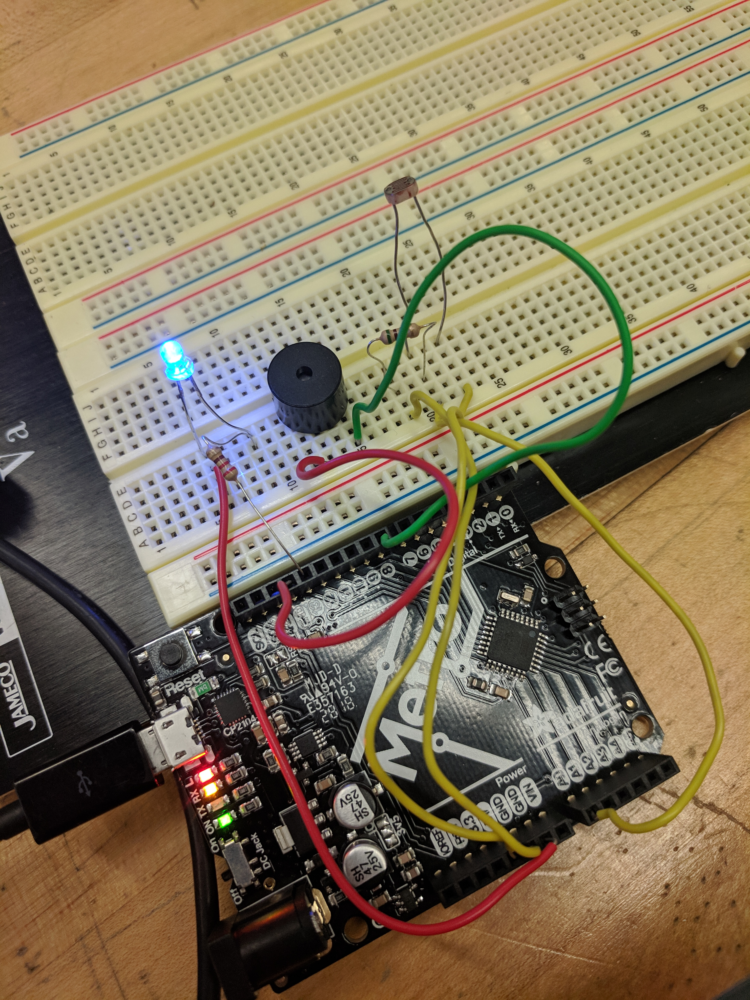
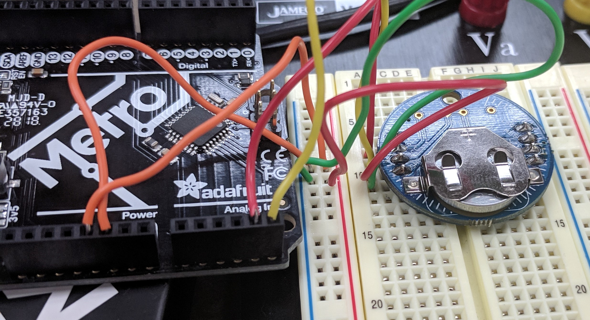

# P00: Project 1
*Light Sensing alarm clock.*

**Author(s)**: *Robert Hogsed, Dustin Young*

**Google Document**: *https://docs.google.com/document/d/13ItNKoVccImAGchtWhf9rGwZOyrfzWHT7rk_OlpwcUo/edit?usp=sharing*

---
## Purpose

Once common problem with an alarm clock is that most people will simply hit the snooze button and still not wake up. Our solution is to create an alarm clock that uses a light sensor to make sure that you've gotten out of bed and turned on your light before the alarm stops ringing. If you've already stood up, walked across your room, and turned on your light you are much less likely to fall back asleep.

## Initial Design Plan

The following components will be used in our design. 

- Arduino Metro -this is what controlls everything
- photoresistor- will detect light levels in the room to determine when to stop the alarm
- speaker - this is what will make the alarm noise
- Real Time Clock - This will be able to tell the time, which will control when the device begins sounding off.
- led light - this will work as just a second indicator of when the alarm is sounding and will shut off when enough light is detected.

The following parts will need to be coded.
  
- Clock- We will need a clock to both tell what time it is, but also to determine when to start sounding the alarm to wake up
- light sensing- we will need to tell the alarm to stop sounding when the photoresistor detects a certain level of light, and we will have to take into consideration ambient light
- tune- we will need to tell the speaker what kind of sound to make
- We are considering adding a temperautre sensor as well as a few more colored leds. Different colored leds will light up to indicate roughly what the temerature is.

**Very early version 1**:

**Our actual work so far**:

Where we are at as of 1/24/19. There is a led that will stay lit when the light level is above the alarm shutoff point. The buzzer is used to make the alarm sound, but we would like to switch this to a larger speaker for a bit more volume. Then we have the light sensor. We have tested it a alot and right now we have it to where the alarm will not sound as long as the light in the room is bright enough. When we cover the sensor to reduce the light level the alarm begins to sound and the LED shuts off. Next we will work on getting the real time clock up and running and have our code only run between a set time (whenever you want to set your alarm for)
**clock is up and running**

The RTC is now set up and ticking. The alarm part of the code is now up and working and our alarm will sound when the clock reaches whaterever time you have it set for, currently it is set for 7:30 and will ring until it shuts off either by you turning on the lights or when it eventually gives up at 7:40.

## Files
- alarmclock - this is our code for the actual project. We are happy with the project so far
- v1 - this was a basic mockup drawing made in Fritzing.
- v2 - this is a picture of what we have so far. We still need to add the real world clock which we are figuring out how to use.
- README.md - keeps track of our project, and lays out out plans and ideas
- designdoc.docx - a google doc that explains our project the pieces to it and how it works
- TRClib.zip library to set up the RTC    -https://github.com/adafruit/RTClib

## Summary
*You'll complete this part at the end of the project.*

Provide a brief summary description of the design and implementation,
including how much your initial design plan evolved, the final result
you achieved and the amount of time you spent as a programmer in
accomplishing these results, including any challenges overcome and
innovations that were not specifically required by the assignment.
This section should be no more than three paragraphs.

## Instructions
1. Set the time which you want the alarm to go off
2. When the alarm starts to ring the only way to silence it is to turn on your lights.

## Errors and Constraints
- one constarint we forsee is not knowing the exact ambient light level of every room. All our testing so far has been set up in the classroom. we will conduct future tests in various lighting to help aleviate this issue.
- I have noticed that the RTC has lost time before. Somtimes its just a few second sometimes its a few minutes and I am not sure why.

## Reflection
*You'll complete this part at the end of the project.*

Write 2 - 4 paragraphs on your reactions to the final project. 
Your reflection should be thoughtful and reflective. 
It is NOT a report about WHAT you did. 
Instead, it's a look back at what you learned by doing this project.
It should be critical of shortcomings (yours, as well as the instructors/assignments) 
as well as celebratory of what was achieved.

## References
- v1 picture made in fritzing app http://fritzing.org/home/
- photo resistor help https://learn.adafruit.com/photocells/arduino-code
- buzzer help was found in the arduion ide examples library
- led light help https://www.arduino.cc/en/tutorial/blink
- markdown help for readme https://www.markdownguide.org/cheat-sheet/
- Chronodot setup https://github.com/adafruit/RTClib

## Final Self-Evaluations
*You'll complete this part at the end of the project. 
Assign points to each team member in each category, based on their contribution to the team. 
The sum of all member's points in each category cannot exceed 10. 
For example, for Coding, Partner 1 could get 7 points, and Partner 2 gets 3 points. 
You can't give both people 6 points each though, as the sum exceeds 10.

### Ideation, Brainstorming, Design:

*Partner 1 (replace this with your name): 0-10*

*Partner 2 (replace this with your name): 0-10*

### Code creation: 

*Partner 1 (replace this with your name): 0-10*

*Partner 2 (replace this with your name): 0-10*

### Documentation creation:

*Partner 1 (replace this with your name): 0-10*

*Partner 2 (replace this with your name): 0-10*

### Teamwork & Participation:

*Partner 1 (replace this with your name): 0-10*

*Partner 2 (replace this with your name): 0-10*
