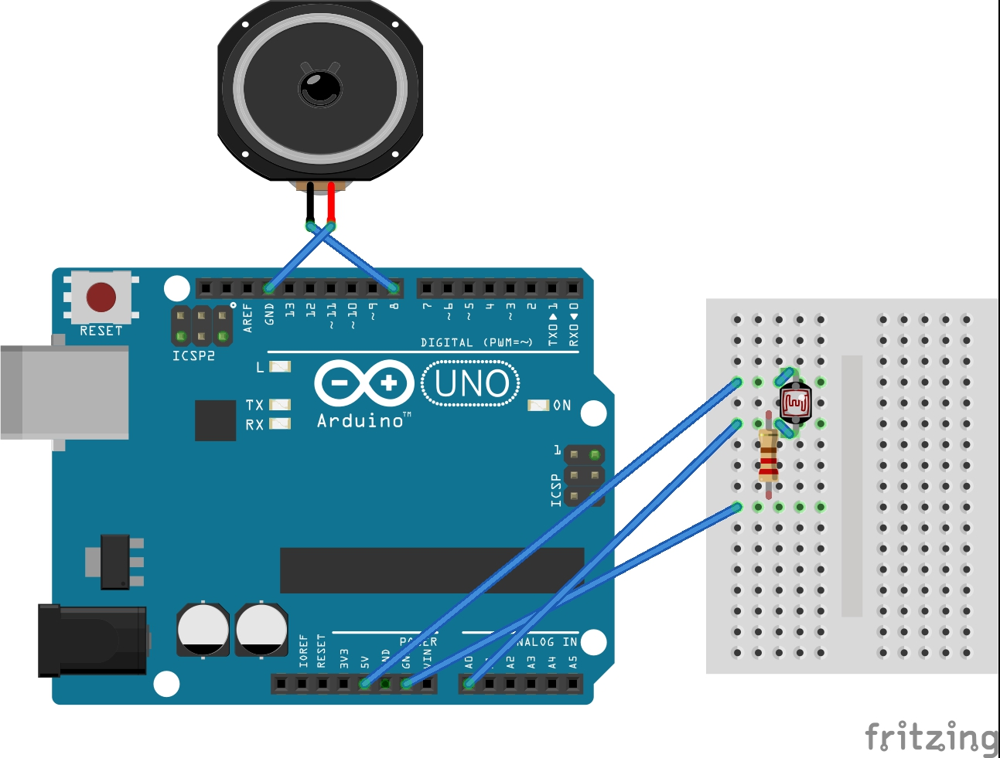

# P00: Project 1
```diff
- Great idea. A little simple, so I expect perfection on the build and coding.
- Remove all help text from this document, mostly in italics. It should ONLY be your writing!
- NO REFERENCES?!!?
- Files section is empty.
- You're missing a very important component, the Real time clock (RTC). There's plenty in the lab.
- "Other features as we think of them" is not good enough; think of them. Then, add them here. 
- Your journals are barely readable, if at all. I could only read part of Dustin's; none of Robert's.
- Great diagram! Keep updating it as you figure things out.
```
*Light Sensing alarm clock.*

**Author(s)**: *Robert Hogsed, Dustin Young*

**Google Document**: *https://docs.google.com/document/d/13ItNKoVccImAGchtWhf9rGwZOyrfzWHT7rk_OlpwcUo/edit?usp=sharing*

---
## Purpose
*You'll complete this section as part of Milestone 1.*

Once common prblem with alarm clock is most people will simply hit the snooze button and still not wake up. Our solution is to create an alarm clock that uses a light sensor to make sure that you've gotten out of bed and turned on your light before the alarm stops ringing. If you've already stood up, walked across your room, and turned on your light you are much less likely to fall back asleep.

## Initial Design Plan
*You'll complete this section as part of Milestone 1, and update regularly.*

Outline the product you're creating:
- Arduino UNO -this is what controlls everything
- photoresistor- will detect light levels in the room to determine when to stop the alarm
- speaker - this is what will make the alarm noise

List all of the known parts in the code you'll be creating.
  
- Clock- We will need a clock to both tell what time it is, but also to determine when to start sounding the alarm to wake up
- light sensing- we will need to tell the alarm to stop sounding when the photoresistor detects a certain level of light, and we will have to take into consideration ambient light
- tune- we will need to tell the speaker what kind of sound to make
-other features may be added as we think of them

**Very early version 1**:



**NOTE**: Your initial design plan may not fully reflect your final product,
as projects evolve over time.

## Files
*You'll complete this section as part of Milestone 1.*

List every file in your repository, and briefly summarize each file's purpose in a sentence.

## Summary
*You'll complete this part at the end of the project.*

Provide a brief summary description of the design and implementation,
including how much your initial design plan evolved, the final result
you achieved and the amount of time you spent as a programmer in
accomplishing these results, including any challenges overcome and
innovations that were not specifically required by the assignment.
This section should be no more than three paragraphs.

## Instructions
Explain how to use your product. 
This section should THOROUGHLY describe its usage (i.e., more than just "Push start").

## Errors and Constraints
*You'll complete this part at the end of the project.*

Every program has bugs. Use this section to create a bullet list of
all known errors and deficiencies that remain in your product. 
Also, list any constraints that must exist for your product to work 
(e.g., Only works in low light situations).

## Reflection
*You'll complete this part at the end of the project.*

Write 2 - 4 paragraphs on your reactions to the final project. 
Your reflection should be thoughtful and reflective. 
It is NOT a report about WHAT you did. 
Instead, it's a look back at what you learned by doing this project.
It should be critical of shortcomings (yours, as well as the instructors/assignments) 
as well as celebratory of what was achieved.

## References
*Start this section at the beginning of the project, and update it throughout.*

Throughout this project, you'll be used outside resources.
Reference ALL ideas or code which are not your own, and describe and
how you integrated the ideas or code into your program. This includes
online sources, people who have helped you, and any other resources that
are not solely your own contribution. Lastly, include ALL resources you
looked at, not just the ones you ended up using directly.

## Final Self-Evaluations
*You'll complete this part at the end of the project. 
Assign points to each team member in each category, based on their contribution to the team. 
The sum of all member's points in each category cannot exceed 10. 
For example, for Coding, Partner 1 could get 7 points, and Partner 2 gets 3 points. 
You can't give both people 6 points each though, as the sum exceeds 10.

### Ideation, Brainstorming, Design:

*Partner 1 (replace this with your name): 0-10*

*Partner 2 (replace this with your name): 0-10*

### Code creation: 

*Partner 1 (replace this with your name): 0-10*

*Partner 2 (replace this with your name): 0-10*

### Documentation creation:

*Partner 1 (replace this with your name): 0-10*

*Partner 2 (replace this with your name): 0-10*

### Teamwork & Participation:

*Partner 1 (replace this with your name): 0-10*

*Partner 2 (replace this with your name): 0-10*
